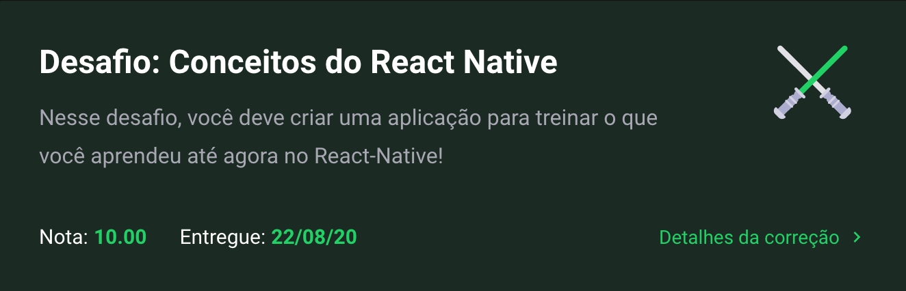
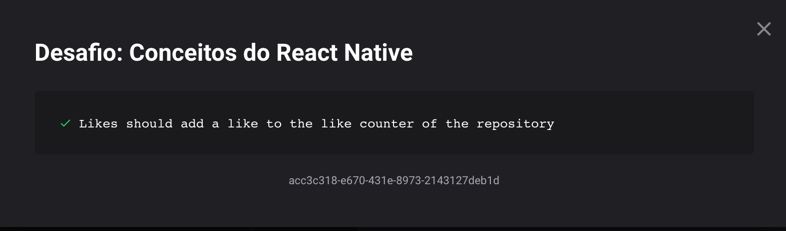

<h1 align="center">
  Challenge 03 - Course GoStack
</h1>

## What is dealt with in the challenge?

This challenge is about Concepts of Reacr Native

## What does the exercise aks for?

Now that you have the template cloned, and ready to continue, you must open the src / App.js file, and complete where you don't have the code with the code to achieve the objectives of each feature.

```List the repositories of the API```: You should be able to create a list of all the repositories that are registered in your API with the fields of ```title```, ```techs``` and ```number``` of likes following the pattern ```${repository.likes} curtidas```, just changing the number to be dynamic.

```Like a listed API repository```: You should be able to reduce an item in your API via a button with the text Like and you must update the number of likes in the listing on the mobile.

Link to the challenge repository from RocketSeat **[here!](https://github.com/rocketseat-education/bootcamp-gostack-desafios/tree/master/desafio-conceitos-react-native)**

## Does Gui made it?

Hehehe, yes! :)

Here's my results:




